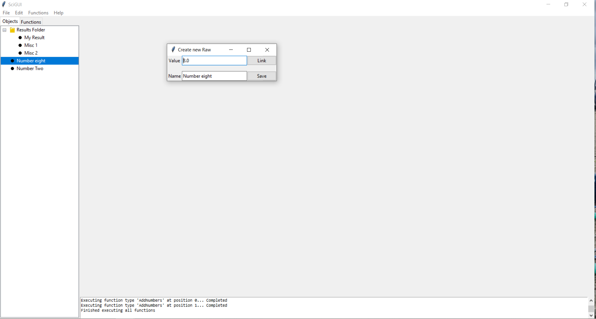
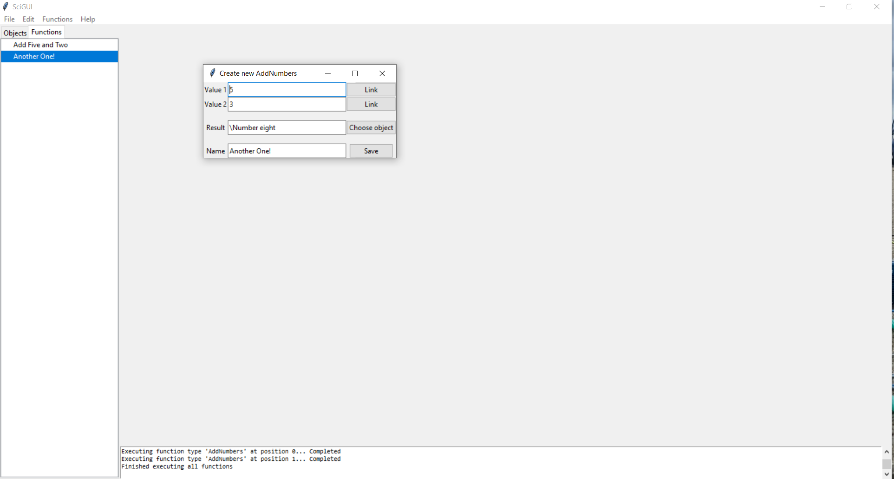

# scigui

Python package for easily turning your system models into a cool GUI interface. Try running example.py to see an example of what it can do.

Essentially splits your GUI into "Objects" and "Functions". All you have to do is submit a list of these to the package, with any relevant inputs and outputs, and what the function actually does, and it will generate a cool GUI for you to use.

Can be installed with by downloading this repository, navigating to the folder with setup.py, and running `pip install .` in your command prompt.

## Screenshots

	
	

